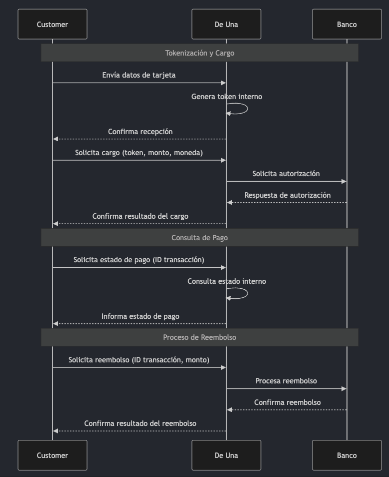

# Welcome to Payment Platform API project!

this project is a payment platform api that allows customers to process payments, query payment status and refund payments.

## Sequence diagram

### Players

- Customer
- De Una
- Banco



## Technical stack

- AWS CDK
- AWS DynamoDB
- AWS API Gateway
- AWS Lambda

This open source project uses the AWS CDK to deploy the infrastructure and the AWS Lambda functions to handle the payment flow.

AWS is a good choice for this project because it provides a reliable and scalable infrastructure that can handle the load of the payment flow.

The AWS CDK is a powerful tool that allows you to define your infrastructure as code, which makes it easier to manage and deploy your infrastructure.

### API Gateway

| Method | Endpoint     | Description    |
| ------ | ------------ | -------------- |
| POST   | /token       | Generate token |
| POST   | /charge      | Create charge  |
| POST   | /refund      | Refund charge  |
| GET    | /charge/{id} | Get charge     |

### DynamoDB

| Table   | Description        |
| ------- | ------------------ |
| Tokens  | Stores the tokens  |
| Charges | Stores the charges |

### Lambda

| Function  | Description    |
| --------- | -------------- |
| Token     | Generate token |
| Charge    | Create charge  |
| Refund    | Refund charge  |
| GetCharge | Get charge     |

### Mock Bank

The mock bank is a simple http server that receives the payment information.

[mountebank](https://github.com/bbyars/mountebank)

## Go version

go version 1.21 or higher

## Install dependencies

Issue the go get command to install all required modules and update go.mod.

```bash
go get
```

## Build functions

Run the following command to build the functions.

```bash
Make build
```

## configure aws credentials

Run the following command to configure aws credentials.

```bash
aws configure
```

## cdk bootstrap

Run the following command to bootstrap the cdk environment.

```bash
cdk bootstrap
```

## cdk synth

Run the following command to synthesize the cdk stack.

```bash
cdk synth
```

## cdk deploy

Run the following command to deploy the cdk stack.

```bash
cdk deploy
```

## improvements

- Add more tests
- Add lambda authentication to protect the api
- Add audit logs
- add middleware to validate request body and return a generic response structure
