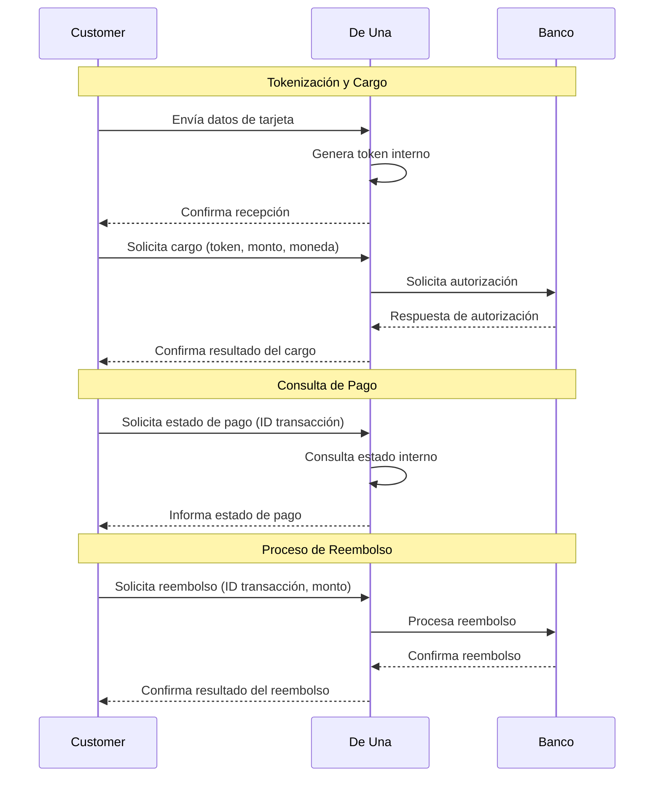

```mermaid
sequenceDiagram
    participant Customer
    participant API/PSP as De Una
    participant Banco

    Note over Customer,Banco: Tokenización y Cargo
    Customer->>API/PSP: Envía datos de tarjeta
    API/PSP->>API/PSP: Genera token interno
    API/PSP-->>Customer: Confirma recepción

    Customer->>API/PSP: Solicita cargo (token, monto, moneda)
    API/PSP->>Banco: Solicita autorización
    Banco-->>API/PSP: Respuesta de autorización
    API/PSP-->>Customer: Confirma resultado del cargo

    Note over Customer,Banco: Consulta de Pago
    Customer->>API/PSP: Solicita estado de pago (ID transacción)
    API/PSP->>API/PSP: Consulta estado interno
    API/PSP-->>Customer: Informa estado de pago

    Note over Customer,Banco: Proceso de Reembolso
    Customer->>API/PSP: Solicita reembolso (ID transacción, monto)
    API/PSP->>Banco: Procesa reembolso
    Banco-->>API/PSP: Confirma reembolso
    API/PSP-->>Customer: Confirma resultado del reembolso
```
